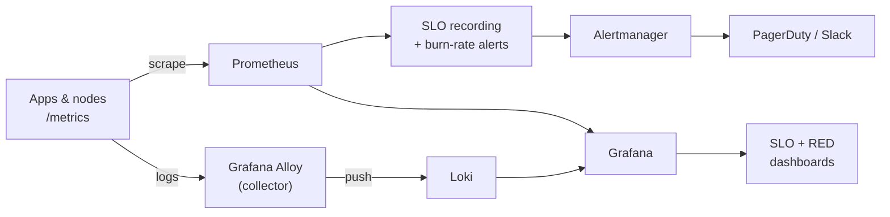

# observability-slo-stack

[](https://prometheus.io/)
[](https://grafana.com/)
[](https://grafana.com/oss/loki/)
[](LICENSE)

A drop-in **observability stack** — Prometheus, Grafana, Loki and **Grafana Alloy** —
plus **SLO/SLI** recording rules, **multi-window multi-burn-rate** error-budget alerts,
and ready-made Grafana dashboards. Run it locally with `docker compose up` or deploy the
same rules to Kubernetes.

> Built from the observability work in my SRE role: Prometheus metrics + centralized
> logging via Alloy/Loki to cut MTTD, and explicit SLO/SLI/error-budget frameworks to
> drive release decisions.

## Architecture



## What you get

| Area | File(s) |
|------|---------|
| Scrape config | `prometheus/prometheus.yml` |
| SLI recording rules | `prometheus/rules/sli-recording.yml` |
| Error-budget burn-rate alerts | `prometheus/rules/slo-burnrate-alerts.yml` |
| Infra/host alerts | `prometheus/rules/infra-alerts.yml` |
| Alertmanager routing | `alertmanager/alertmanager.yml` |
| Log collection | `alloy/config.alloy` |
| Grafana dashboards | `grafana/dashboards/*.json` |
| Local stack | `docker-compose.yml` |
| K8s rules (PrometheusRule) | `k8s/prometheusrule-slo.yaml` |

## SLO model

Each service defines an **SLO target** (e.g. 99.9% availability over 30 days). The
recording rules compute the SLI; the alerts fire on **error-budget burn rate** using the
Google SRE multi-window approach so you page on *fast* burn and ticket on *slow* burn:

| Severity | Long window | Short window | Budget consumed |
|----------|-------------|--------------|-----------------|
| page | 1h | 5m | 2% in 1h (14.4x burn) |
| page | 6h | 30m | 5% in 6h (6x burn) |
| ticket | 24h | 2h | 10% in 24h (3x burn) |

## Quick start (local)

```bash
docker compose up -d
# Grafana   → http://localhost:3000  (admin / admin)
# Prometheus→ http://localhost:9090
# Loki      → http://localhost:3100
```

Generate some traffic, then open the **"SLO / Error Budget"** dashboard in Grafana.

## Validate

`.github/workflows/ci.yml` runs `promtool check rules` on every rule file and
`promtool check config` on the scrape config.

## License

MIT © Ayushi Shrotriya
